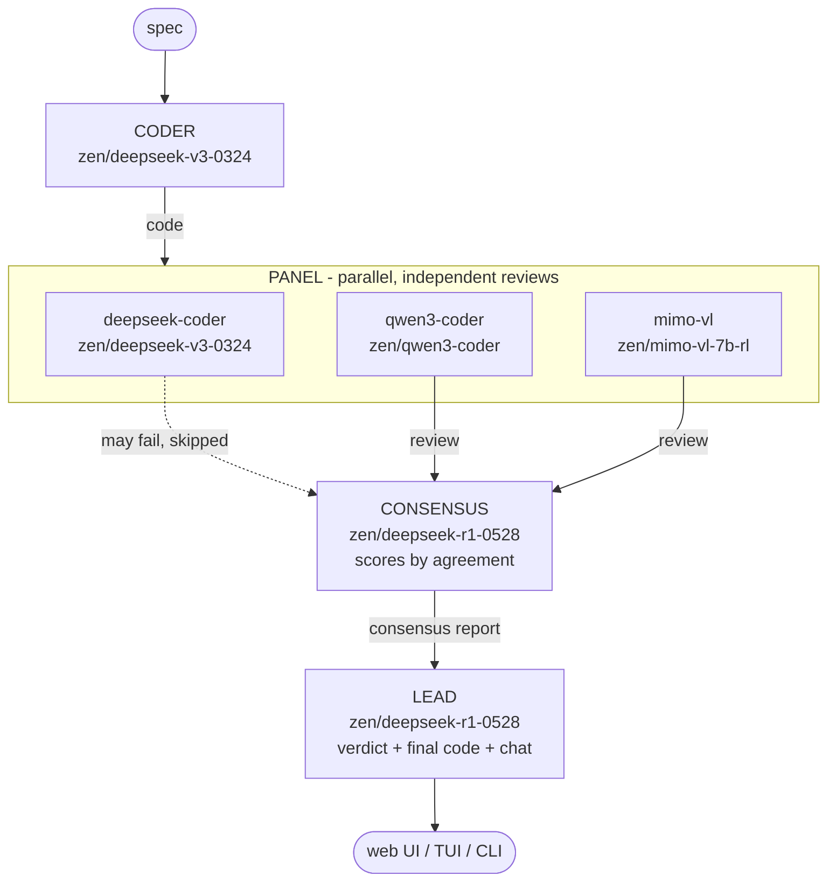

# Consensus

Multi-agent code review running on any OpenAI-compatible provider. Free by
default on [Zen](https://opencode.ai) (no credit card required).

A **coder** model writes code from a spec. A **panel** of independent models
reviews it in parallel. A **consensus** step scores each issue by how many
reviewers agreed. A **lead** model arbitrates and produces the final code.
You then chat with the lead about the result.

The idea: a finding confirmed by several independent reviewers is high
confidence; a finding raised by only one reviewer is a candidate that may be
a false positive. Consensus scoring makes that explicit instead of trusting
one model blindly.

## Architecture



The panel is resilient: if a reviewer call fails it is skipped and consensus
uses the reviewers that answered. A single model never blocks a run.

## Providers

Any OpenAI-compatible endpoint works as a provider. Four are preconfigured:

| Name        | Transport             | Default base URL                          |
|-------------|-----------------------|-------------------------------------------|
| `zen`       | OpenAI-compatible     | `https://opencode.ai/zen/v1` (free)       |
| `openai`    | OpenAI-compatible     | `https://api.openai.com/v1` (configurable)|
| `anthropic` | Anthropic Messages    | `https://api.anthropic.com/v1`            |
| `local`     | OpenAI-compatible     | `$LOCAL_BASE_URL` (Ollama, vLLM, ...)     |

Models are referenced as `provider/model-id` in environment variables, e.g.
`zen/deepseek-r1-0528` or `anthropic/claude-opus-latest`.

## Quickstart (Zen, free)

1. Get a free Zen key at https://opencode.ai.

2. Configure:
   ```
   cp .env.example .env
   # edit .env: set ZEN_API_KEY
   ```

3. Start:
   ```
   make up
   ```
   Open http://localhost:8800

## Prerequisites

- Docker and Docker Compose v2.
- `make`.
- A provider key (Zen is free; see `.env.example` for other providers).

## Make targets

`make` (or `make help`) lists everything.

| Target               | Action                                             |
|----------------------|----------------------------------------------------|
| `make up` / `start`  | Start the stack, detached (builds if needed)       |
| `make down` / `stop` | Stop and remove the stack                          |
| `make update`/`reload`| Rebuild and recreate the app after code changes   |
| `make restart`       | Restart the app without rebuilding                 |
| `make logs`          | Follow the app logs                                |
| `make run SPEC="..."` | Run the pipeline on the CLI                       |
| `make index`         | Index `docs-projet/` into the RAG store            |
| `make nuke`          | Stop and delete volumes (wipes pgvector data)      |
| `make check`         | Lint + typecheck + test (CI entrypoint)            |

`ENV=<name>` merges `.env.<name>` on top of `.env` and layers
`docker-compose.<name>.yml` if present. `DEV=1` adds hot reload.

## Multi-file output and archives

The coder and lead can emit a whole file tree. The LLM never produces a
binary: it returns `files` as JSON (path + content), and the server packs the
requested archive format. The chat can also regenerate the tree on demand.

Supported archive formats: `zip`, `tar`, `tar.gz`, `tar.bz2`, `tar.xz`, `7z`.

## CLI usage

```
make run SPEC="write a Go HTTP server with graceful shutdown"
```

## RAG (optional, off by default)

RAG is disabled unless `use_rag=True` is set.

1. Put documents under `docs-projet/` (.md, .txt, .py, .rst).
2. `make index`

Two backends: `pgvector` (default, requires Postgres, bundled in compose) and
`sqlite` (single file, set `RAG_BACKEND=sqlite` in `.env`).

## Rate limits and low-quota mode

Providers enforce quotas. The client retries 429/503 with exponential backoff
and jitter (honoring `Retry-After`). When retries are exhausted,
`AUTO_LOW_QUOTA=1` switches on low-quota mode automatically:

- Coder and consensus drop to `LOW_QUOTA_MODEL`.
- The panel shrinks to `LOW_QUOTA_PANEL_SIZE` reviewers.
- **The lead is never downgraded.**

Toggle it manually from the header pill or via `POST /api/quota`.

## Configuration

All in `.env`. See `.env.example` for the full reference with comments.

### Key variables

| Variable         | Default                   | Purpose                              |
|------------------|---------------------------|--------------------------------------|
| `ZEN_API_KEY`    | (required for Zen)        | Zen provider key                     |
| `CODER_MODEL`    | `zen/deepseek-v3-0324`    | Coder role model                     |
| `CONSENSUS_MODEL`| `zen/deepseek-r1-0528`    | Consensus role model                 |
| `LEAD_MODEL`     | `zen/deepseek-r1-0528`    | Lead role model                      |
| `REVIEW_PANEL`   | (Zen default panel)       | `name:provider/model[:max_tokens]`   |
| `RAG_BACKEND`    | `pgvector`                | `pgvector` or `sqlite`               |
| `AUTO_LOW_QUOTA` | `1`                       | Auto-enable low-quota on 429         |

## Security posture

- Binds to loopback only (see `docker-compose.yml`); no application auth.
- CORS restricted to `ALLOWED_ORIGINS`.
- Input sizes capped before any billable call (`MAX_SPEC_CHARS`, `MAX_MESSAGE_CHARS`).
- Artifact paths sanitized against zip-slip on ingestion and before archiving.
- No secrets baked into the image; `.gitignore` excludes all `.env*` files
  except `.env.example`.

## File structure

```
consensus/
  README.md
  Makefile                    command interface (make help)
  docker-compose.yml          base stack (pgvector + app)
  docker-compose.dev.yml      overlay: hot reload (DEV=1)
  Dockerfile                  context-neutral image
  requirements.txt
  .env.example                config template (copy to .env)
  docs-projet/                drop RAG documents here
  src/
    config.py                 env loading, provider registry, logging
    llm.py                    httpx transports (openai-compatible + anthropic)
    governor.py               rate-limit (aiolimiter) + retry (tenacity) + fallback
    models.py                 pydantic schemas (Usage, CostSummary, ...)
    agents.py                 coder, reviewer, consensus, lead
    pipeline.py               orchestration: run() and run_streaming() (SSE)
    sessions.py               session store (TTL + LRU cap; memory or postgres)
    archive.py                pack a file tree into zip/tar(.gz/.bz2/.xz)/7z
    quota.py                  low-quota mode toggle
    rag.py                    optional pgvector + embeddings (or sqlite-vec)
    api.py                    FastAPI endpoints + SSE streaming
    static/index.html         single-page chat UI
    static/vendor/            vendored highlight.js + dark theme (offline, BSD-3)
  tui/                        optional Textual terminal UI
  tests/                      offline unit tests (pytest)
```

## License

MIT. See [LICENSE](LICENSE).

This project bundles [Highlight.js](https://highlightjs.org/) under the
BSD 3-Clause License.
