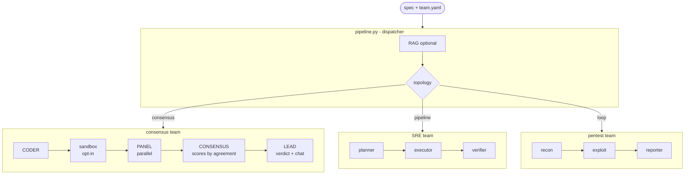

# Consensus

Multi-agent orchestration running on any OpenAI-compatible or Anthropic provider.
Free by default on [Zen](https://opencode.ai) (no credit card required).

Domains are declared as **team manifests** (`teams/*.yaml`). The default team
performs multi-agent **code review**: a coder writes, a panel of independent
models reviews in parallel, a consensus step scores each issue by agreement,
and a lead arbitrates and produces the final code.

Other built-in teams: **SRE/DevOps** (planner -> executor -> verifier) and
**pentest/CTF** (recon -> exploit -> report loop). Adding a domain requires only
a new YAML file - no application code changes.

## Architecture



All LLM calls: httpx -> provider, routed through `governor.py`
(rate-limit + retry + fallback). No SDK, no agent framework.

## Providers

| Name        | Transport          | Default base URL                          |
|-------------|--------------------|-------------------------------------------|
| `zen`       | OpenAI-compatible  | `https://opencode.ai/zen/v1` (free)       |
| `openai`    | OpenAI-compatible  | configurable `OPENAI_BASE_URL`            |
| `anthropic` | Anthropic Messages | `https://api.anthropic.com/v1`            |
| `local`     | OpenAI-compatible  | `LOCAL_BASE_URL` (Ollama, vLLM, ...)      |

Models use the `provider/model-id` format: `zen/deepseek-r1-0528`,
`anthropic/claude-opus-latest`, `local/qwen2.5-coder`.

## Quickstart (Zen, free)

1. Get a free Zen key at https://opencode.ai.
2. Configure:
   ```
   cp .env.example .env
   # edit .env: set ZEN_API_KEY and PG_PASSWORD (any string, e.g. "changeme")
   ```
3. Start:
   ```
   make up
   ```
   Open http://localhost:8800

### Fork in 5 minutes

```
git clone https://github.com/log0u7/consensus.git
cd consensus
cp .env.example .env
# Required: ZEN_API_KEY and PG_PASSWORD
# Optional: CODER_MODEL, LEAD_MODEL, REVIEW_PANEL (see .env.example)
make up
```

That is it. The stack starts two containers: `consensus-app` (port 8800) and
`consensus-pgvector` (Postgres + pgvector, used by the optional RAG feature).

To run a task on the CLI instead of the UI:
```
make run SPEC="Write a Python function that validates an email address"
```

To add a new domain without touching application code:
```
cp teams/consensus.yaml teams/my-domain.yaml
# edit my-domain.yaml: set topology, models, roles
# optionally add skills/my-domain/SKILL.md
```

## Teams and topologies

Teams are YAML files in `teams/`. Three topologies are available:

| Topology    | Flow                                  | Example team     |
|-------------|---------------------------------------|------------------|
| `consensus` | coder -> panel -> consensus -> lead   | `consensus.yaml` |
| `pipeline`  | role1 -> role2 -> role3 (sequential)  | `sre.yaml`       |
| `loop`      | roles cycle until `[DONE]`            | `pentest.yaml`   |

To use a non-default team via the CLI:
```
# (currently via pipeline.run directly; UI team selection coming in a future version)
```

### Adding a domain

1. Create `teams/<name>.yaml` with `topology`, `sandbox`, and `roles`.
2. Add `skills/<name>/SKILL.md` if domain expertise is needed.
3. Run `make test`.

No application code changes required.

## Sandbox (opt-in)

When `sandbox: true` is set on a role, the coder's generated code is executed
before the panel reviews it. Reviewers see actual execution output.

**Engines** (set `SANDBOX_ENGINE`):
- `docker` (default): throwaway container, `--network none`, read-only FS,
  memory + CPU limits. Requires Docker.
- `subprocess`: local subprocess with timeout. **No real isolation** - local
  dev only.
- `none`: skip execution.

## Skills

Skills are Markdown files loaded into the prompt when a role references them.
Bundled skills: `coding`, `review`, `sre`, `pentest`.

Add a skill: create `skills/<name>/SKILL.md`. Reference in team YAML:
```yaml
roles:
  planner:
    skills: [sre, coding]
```

## MCP tools (optional)

Tools are provided by MCP servers (Serena for LSP, custom infra tools, etc.).
The `mcp` SDK is a soft dependency - only needed when tools are listed in a team.

```
pip install mcp
```

**Serena (LSP)** - reduces token usage by providing symbolic code navigation
instead of dumping whole files. Launch externally:
```
uvx --from git+https://github.com/oraios/serena \
  serena start-mcp-server --context ide-assistant --project .
```
Then list it under `tools:` in your team manifest.

## Cache

Set `RESPONSE_CACHE=1` to cache identical LLM calls locally. Useful during
development and for repeated runs on the same code.

```
RESPONSE_CACHE=1
CACHE_BACKEND=sqlite      # or "memory" (default, lost on restart)
CACHE_DB_PATH=cache.db
```

## Make targets

| Target                  | Action                                            |
|-------------------------|---------------------------------------------------|
| `make up` / `start`     | Start the stack, detached (builds if needed)      |
| `make down` / `stop`    | Stop and remove the stack                         |
| `make update` / `reload`| Rebuild and recreate the app after code changes   |
| `make logs`             | Follow the app logs                               |
| `make run SPEC="..."`   | Run the pipeline on the CLI                       |
| `make index`            | Index `docs-projet/` into the RAG store           |
| `make check`            | Lint + typecheck + test (CI entrypoint)           |

`DEV=1` adds hot reload. `ENV=<name>` merges `.env.<name>` and layers
`docker-compose.<name>.yml`.

## RAG (optional, off by default)

1. Put documents under `docs-projet/` (.md, .txt, .py, .rst).
2. `make index`
3. Set `use_rag=true` per request (API or CLI).

Two backends: `pgvector` (default, bundled in compose) and `sqlite`
(`RAG_BACKEND=sqlite`, single file, no server).

## Rate limits and low-quota mode

The governor retries 429/503 with exponential backoff (honouring `Retry-After`).
When retries are exhausted, `AUTO_LOW_QUOTA=1` switches on low-quota mode:

- Coder and consensus drop to `LOW_QUOTA_MODEL`.
- The panel shrinks to `LOW_QUOTA_PANEL_SIZE` reviewers.
- **The lead is never downgraded.**

Per-role fallback: `CODER_FALLBACK=local` falls back to a local LLM when Zen
is down.

Toggle low-quota manually from the header pill or `POST /api/quota`.

## Configuration reference

All in `.env`. See `.env.example` for the full reference with comments.

| Variable            | Default                    | Purpose                             |
|---------------------|----------------------------|-------------------------------------|
| `ZEN_API_KEY`       | (required for Zen)         | Zen provider key                    |
| `CODER_MODEL`       | `zen/deepseek-v3-0324`     | Coder role model                    |
| `LEAD_MODEL`        | `zen/deepseek-r1-0528`     | Lead role model                     |
| `REVIEW_PANEL`      | (Zen default panel)        | `name:provider/model[:max_tokens]`  |
| `SANDBOX_ENGINE`    | `docker`                   | `docker`, `subprocess`, or `none`   |
| `RESPONSE_CACHE`    | `0`                        | Set `1` to enable local cache       |
| `RAG_BACKEND`       | `pgvector`                 | `pgvector` or `sqlite`              |
| `AUTO_LOW_QUOTA`    | `1`                        | Auto low-quota on 429 exhaustion    |
| `CODER_FALLBACK`    | (empty)                    | Fallback provider(s) for coder      |

## Security

- Binds to loopback only; no application auth.
- CORS restricted to `ALLOWED_ORIGINS`.
- Input sizes capped before any billable call.
- Artifact paths sanitized against zip-slip (ingestion + archive).
- Sandbox: Docker `--network none`, read-only FS, resource caps, no secrets mounted.
- No secrets baked into the image; `.gitignore` excludes all `.env*` files
  except `.env.example`.

## File structure

```
consensus/
  README.md
  Makefile
  docker-compose.yml / docker-compose.dev.yml
  Dockerfile
  requirements.txt / requirements-dev.txt
  .env.example
  teams/          team manifests (YAML)
  skills/         skill files (SKILL.md per domain)
  docs-projet/    RAG documents (drop files here)
  src/
    config.py     env + provider registry
    providers.py  resolve() + capability metadata
    llm.py        httpx transports (openai-compatible + Anthropic + SSE)
    governor.py   rate-limit + retry + fallback
    agents.py     coder, reviewer, consensus, lead
    pipeline.py   dispatcher (RAG + topologies.run)
    roles.py      Role/Team + YAML loader
    topologies.py consensus / pipeline / loop
    sandbox.py    Docker / subprocess / no-op sandbox
    cache.py      local response cache
    context.py    AgentContext builder (stable prefix)
    skills.py     SKILL.md loader
    mcp_client.py MCP server manager
    rag.py        pgvector + sqlite-vec
    archive.py    zip/tar/7z packing
    models.py     Pydantic schemas
    sessions.py   session store
    quota.py      low-quota toggle
    api.py        FastAPI + SSE
    static/       SPA + vendored highlight.js (BSD-3)
  tui/            Textual terminal UI
  docs/           detailed documentation (teams, providers, RAG, UI)
  tests/          offline unit tests (179+ tests)
```

## Documentation

| Topic                             | File                        |
|-----------------------------------|-----------------------------|
| Teams, topologies, adding a domain | [docs/teams.md](docs/teams.md) |
| Providers, adding a provider      | [docs/providers.md](docs/providers.md) |
| RAG: indexing, backends, opt-in   | [docs/rag.md](docs/rag.md)   |
| Web UI, TUI, API endpoints        | [docs/ui.md](docs/ui.md)     |

## License

MIT. See [LICENSE](LICENSE).

This project bundles [Highlight.js](https://highlightjs.org/) under the
BSD 3-Clause License.
